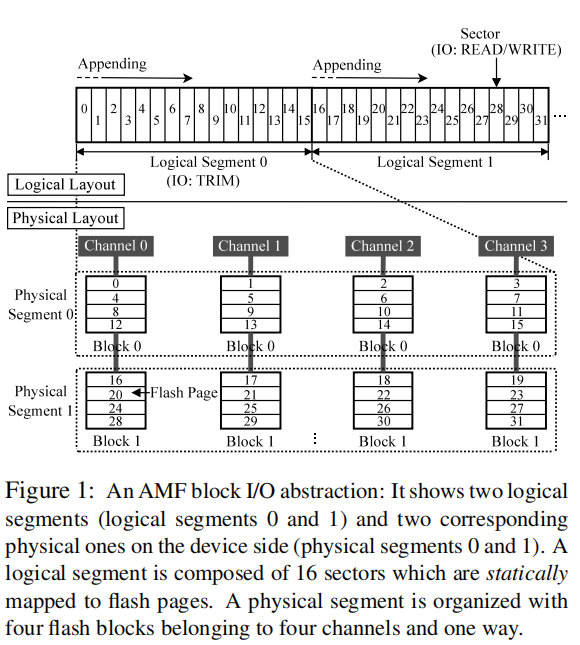
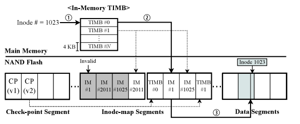
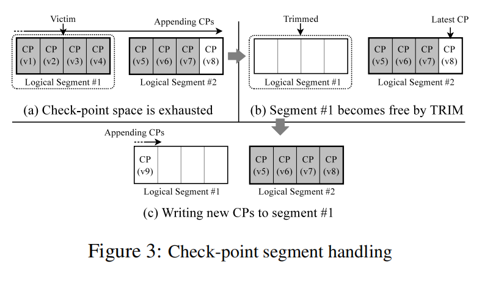

**题目： Application-Managed Flash（AMF)**

会议：FAST 16

**目前SSD缺点**：1. SSD内部需要内存和算力 2.与高层应用无沟通（高层应用不知垃圾回收时间，以及映射表） 3. 与用户功能重复（有的高层应用自身避用更新写，如LSM-Tree，把数据添加，而不是就地更新）

AMF基本规则，不允许用户覆盖写，除非原本数据已经被明确删除了

优点：1.高效排序I/O 2.准确分布冷热数据 3.直接映射到物理地址，而不需要映射表

**FTL功能** 减少到bit错误纠正，数据并行，坏块跟踪，磨损均衡（？？？）

管理密度，以块为单位，减少mapping table

**AMF Block I/O Interface**

三种命令：READ,WRITE and TRIM（以segment为单位）

一个sector（4KB）只能被写一次，除非其所在segment被命令TRIM

一个segment被分配到多个不同通道上的块上，提高带宽

**AMF Log-structured File System**

**inode map**：keep track of inodes scattered across the storage space

每个entry 8B，4B为inode number，4B为location in data segment

将map划分为block，每个block4KB，并将block分散到空闲空间中

如何找到相应inode？

在DRAM中保持一张指向inode-map block的表TIMB

首先在内存中查找TIMB找出包含该inode的inode-map block，再在inode-map中找出指向相应的inode

**inode-map segments 的GC?**

**check-points**：point to the inode map and keep the consistent state of the file system

如何保持一致性？

保存两个固定segment，并标记其版本号，写一个时擦除另外一个。（磨损不均衡？？？？）

**直接apend相比overwrite高效？**

LFS的gc会导致dirty blocks的无效迁移
