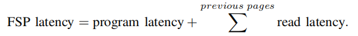

**题目：GSSA: A Resource Allocation Scheme Customized  for 3D NAND SSDs**

会议：hpca21

关键词：full-sequence program (FSP) 将多个bits同时编程进一个cell中，其latency：

```
对于一个full-FSP其延迟和普通写一样
```


```
对于一个partial-FSP其延迟较高，因为要读取原本已经存储在cell中的内容
```


```
```



**现有问题：** FSP提高了program速度，但同时提高的了program粒度，导致GC提高，lifetime降低

两种不适当解决方法：DRAM缓存（受制于sync命令），NVM（价格贵）

四种写操作： (1) baseline program, (2) multi-plane program (MPP), (3) full-sequence program (FSP) （4）MPP+FSP

**提出方法**：generalized scramble allocation (GSA), specialized scramble allocation (SSA)


some thinks：逻辑连续数据存储在一个字线中，读取的时候并行性不就大大降低了吗？？？
