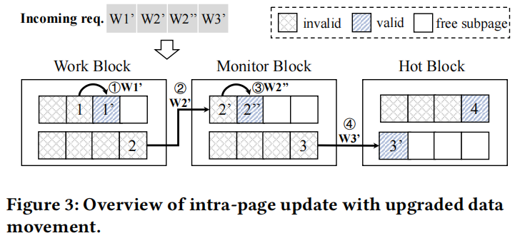
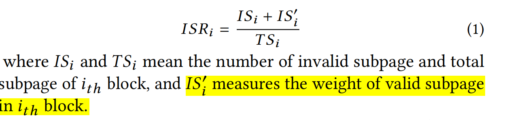
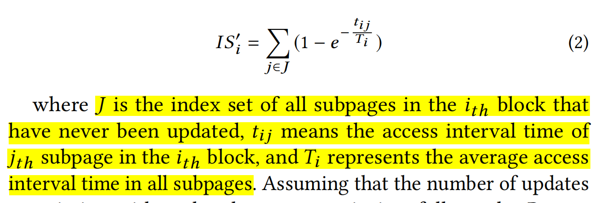

**论文：Intra-page Cache Update in SLC-mode with Partial Programming in High Density SSDs**

**会议**：ICPP21

**关键词**：partial programming：将一个**SLC-mode**的页，分成几部分，多次（厂商限制4次）编程来适应小写

**问题**：partial programming cause in-page disturb and neighboring page disturb，需要二级映射表

提出方法：

1. 将block分为4种， High-density Block（只有TLC-mode）, Work Block, Monitor Block, and Hot Block
2. 将小写的更新在原page上进行，当原page不够用时，挪动到下一种bolck上，Work Block->Monitor Block-> Hot Block
3. 将Work Block上的数据认为是冷数据，在gc时候迁移到High-density Block上

**GC Policy：**

选取最大ISR

some thinks： SLC-mode 和TLC-mode的WL谁率先损坏？？？
