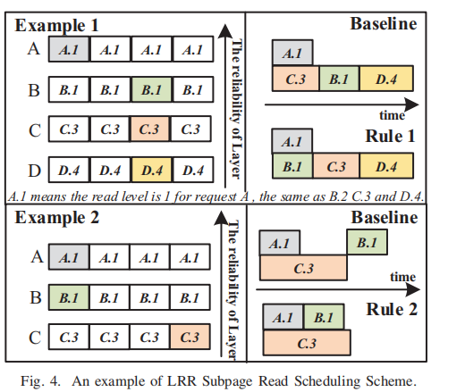
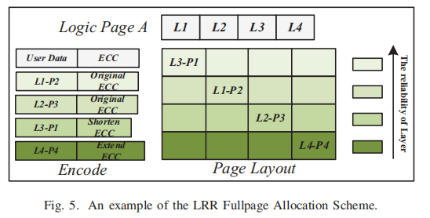

**论文：Layer RBER Variation Aware Read Performance Optimization for 3D Flash Memories（LRR）**

会议：DAC2020

一些名词：subpage（4KB）一般为系统逻辑页大小，fullpage（16KB）目前3D flash 一个页的大小

主要问题：I/O request与现有页大小不匹配4KB via16KB

**现有方法：**

1.将多个小写合并成大写 2.利用subpage programming 3.将来自不同层的子页大小的读取请求进行分组，以提高操作的并行性，从而提高读取的性能(SOML) 4. multi-granularity LDPC

**提出的主要方法(主要解决大的request和小的request)**：

* **subpage read scheduling (SRS)** ：groups small read requests from the layers with similar RBERs to reduce the average read latency of subpage sized read requests
  类似SOML，选取4个不共用bitline的subpage进行并行读（与SOML不同在于选取的subpage的RBERS尽量接近）
  对于某次读的弱subpage，保留其LDPC信息用于下次读

  
* **fullpage allocation (FPA)**： distributes the data of a large write to multiple layers（把强subpage的ECC容量分给弱subpage）, which improves the read latency when reading from layers with large RBERs.

  

增加mapping table大小？

将block分为两种，一种专门用来处理big request，block中subpage组合固定

**some think**

小写一定对应小读吗？大写呢？

没考虑例如TLC不同页面区别？特别是TLC的CSB和MSB（需要都写入才能刷入真正flash，否则暂存在缓存中，那一个block缓存的大小就得是8个fullpage的大小）
