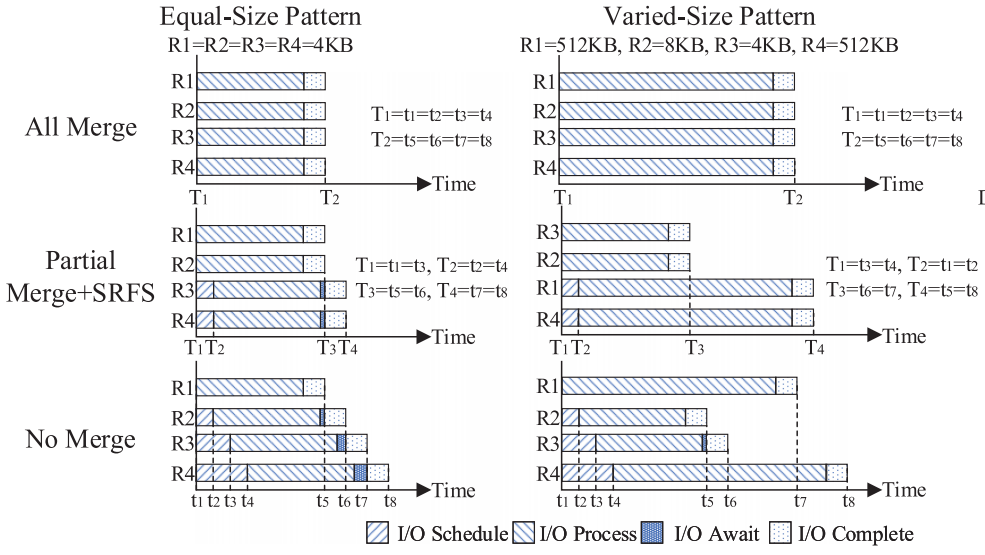
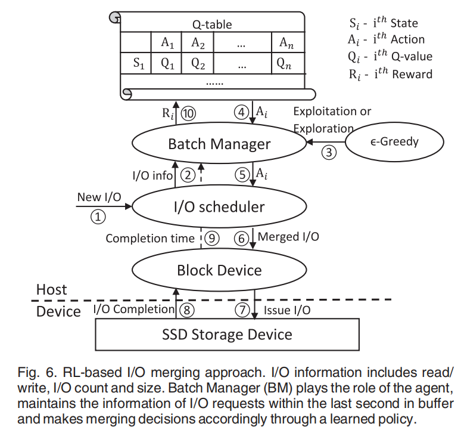
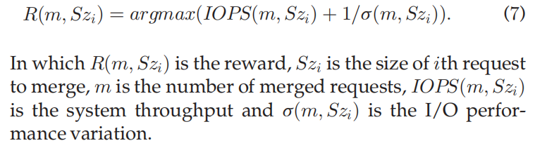

**论文：Maximizing I/O Throughput and Minimizing Performance Variation via Reinforcement Learning Based I/O Merging for SSDs**

会议：TC2019

**关键词 ：**merging technique, reinforcement learning

* merging technique: 尽可能合并多的连续I/O请求作为一条I/O请求（HDD磁头寻址）

**现有问题**：对于HDD来讲，merging technique可以减少磁头的移动（顺序请求较快)，降低延迟。对于SSD来说，则是利用SSD内部的并行性,但可能造成更长的尾延迟

trade off：系统吞吐量和性能差异

**现有方法：**

* static ratio threshold：防止过大请求生成
* temporal merge：合并随机IO

用于SSD的merging technique：不采用merging technique的话，IO scheduler依次一个一个向SSD发送IO请求，导致每个IO请求的开始时间不一致，浪费了SSD的内部并行性。且当任务完成后， 系统还得消耗4个完成开销，采用merging technique则可以并行执行多个IO，共享IO完成开销。

目标：提升吞吐量的同时，降低STD(the standard deviation of I/O latency)

两种merge pattern：

all merge：所有组合到一起（对等长IO请求效果较好，对不等长IO，则会使得小请求延迟听命于大请求延迟。）

partial merge+SRFS：部分合并，优先合并小请求

**Reinforcement Learning**

state：请求数量，请求大小，read/write 操作

action：请求数量阈值、请求大小阈值

reward：

**some thinks：**一般来说，连续逻辑地址在SSD上存放在不同的plane中，所以可以合并多个连续地址来利用SSD内部的并行性。但不是逻辑地址连续的请求其实也可以合并，因为其在SSD上plane的分布也是没有冲突的，FTL能否管理这样的IO请求，或者host可以利用SSD内部的信息吗？
