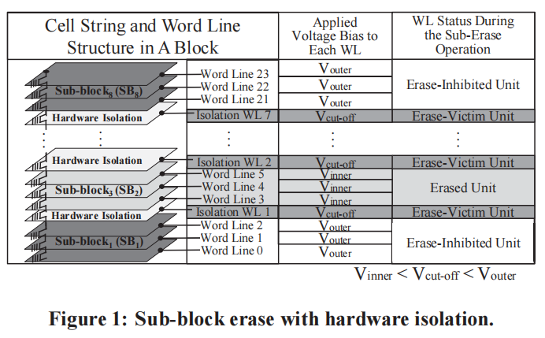

**题目: How to Enable Software Isolation and Boost System Performance with Sub-block Erase over 3D Flash Memory**

会议：CODES+ISSS 2016

ABSTRACT:  提出采用软隔离（利用free or invalid page 作为隔离）的方法解决sub-block erase disturbance 问题，而不浪费额外空间

**sub-block erase :**

* 定义：partition each block into fixed-sized sub-blocks, and multiple sub-blocks can be erased by the new sub-block erase operation together(部分擦除与整个擦除的擦除时间一样)
* 提出原因：too many pages in a block will cause large overhead when GC（more live-page copy)
* 存在问题：1.uneven wearing distribution to sub-blocks of the same block 2. sub-block erase disturbance issue（被擦除的sub-block的紧邻子线会被影响，因为子线间电压差距拉大）
* 目前方法：采用硬隔离

