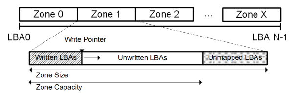

**题目： ZNS: Avoiding the Block Interface Tax for Flash-based SSDs**

会议：ATC 2021

**ZNS:** The NVMe Zoned Namespace Command Set specifification

**Introduction**

* block interface将存储设备呈现为固定大小的逻辑数据块的一维数组，可以以任何顺序读取、写入和覆盖，与SSD的特性不符合。主要由于SSD擦除只能以块为单位。通过FTL隐藏会造成吞吐量限制，写放大，尾延迟等
* ZNS接口将Namespace的逻辑地址块切分为多个zone。一个zone可随机读，但必须顺序写，在重写之前擦除（跟ssd内部相似）。将数据管理转移到主机上，但对主机隐藏了可靠性。

**两种主要降低接口不适配的方法**：Stream SSDs 和 Open-Channel SSDs

* Stream SSDs: 允许用户在写命令中加入流标记（主要是数据的生命周期），将传入数据区分到不同的擦除块上，减少GC，FTL基本不变。
* Open-Channel SSDs：将SSD内部暴露给用户，让用户来管理数据块，磨损均衡等。缺点：对不同SSD都需要不同设计维护，成本高

**ZNS:**

zone四个状态：

* EMPTY:未写入
* OPEN：正在写入，处于OPEN状态的zone数量有限制，跟SSD写并行有关
* CLOSED: 未正在写入
* FULL: 写满

**zone的写指针**：指向下一个可写入的LBA，当且仅当zone状态未EMPTY或者OPEN状态可用。作用：消除用户跟踪最后写入LBA的需要。

两个方法来处理SSD的特性：

* 一个zone可以分为可写区域和不可写区域(使得zone的大小可以和 SMR HDD相匹配，没看懂？)

  
* 限制处于OPEN状态zone的数量。

**How to affect application performance?**

1. 硬件方面：
   放弃随机写入；将zone上的顺序写入转换到不同块上；zone由主机显式重置（不需要over-probisioning）；
   **zone sizing** ：如条带（具备纠删码（可选）），一样横跨多个die，提高读写性能（类似super page？）
   **mapping table**：由于ZNS只支持顺序写，mapping table 可以保持在粗粒度（如擦除块的大小，或则混合粒度）
2. application方面
   **host-side FTL(HFTL)**: 承担mapping 和 gc
   **file system**： 将zone与存储栈结合（如优先队列），获得数据特征更合理的数据放置。
