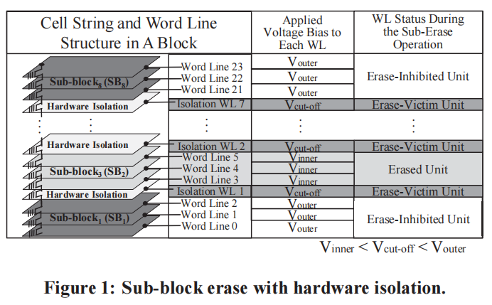
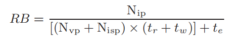
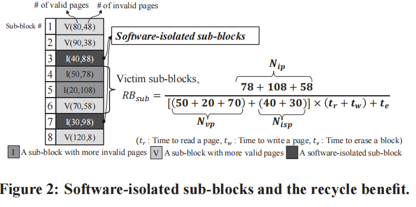
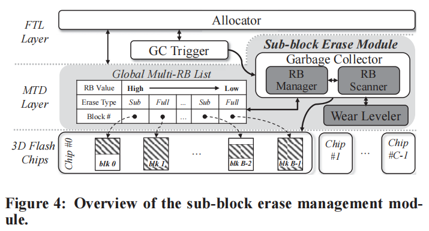
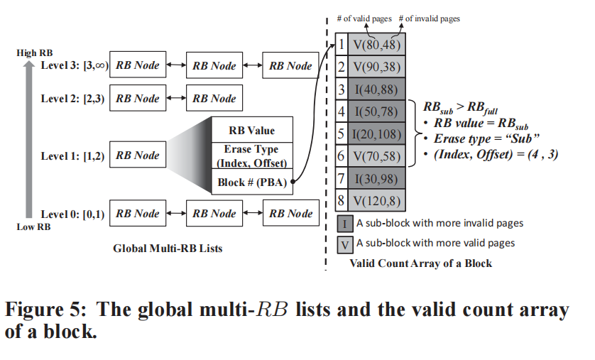

**题目: How to Enable Software Isolation and Boost System Performance with Sub-block Erase over 3D Flash Memory**

会议：CODES+ISSS 2016

ABSTRACT:  提出采用软隔离（利用free or invalid page 作为隔离）的方法解决sub-block erase disturbance 问题，而不浪费额外空间

**sub-block erase :**

* 定义：partition each block into fixed-sized sub-blocks, and multiple sub-blocks can be erased by the new sub-block erase operation together(部分擦除与整个擦除的擦除时间一样)
* 提出原因：too many pages in a block will cause large overhead when GC（more live-page copy)
* 存在问题：1.uneven wearing distribution to sub-blocks of the same block 2. sub-block erase disturbance issue（被擦除的sub-block的紧邻子线会被影响，因为子线间电压差距拉大）
* 目前方法：采用硬隔离，将两个sub-block间的一个条带作为隔离层（隔离层不得存储数据，造成空间浪费）

本问所要解决的问题：解决sub-block erase disturbance 且不消耗额外空间；最小化GC开销；inner-block wear leveling

**Methods**

* uses invalid pages/sub-blocks to serve as the isolation layers of victim sub-block. When a sub-block is marked as isolation layer,  move all the valid pages out of this sub-block before its adjacent sub-blocks are erased.  When a sub-block is not used as an isolation layer, it can be used to store user data again.

**如何选取需要被擦除的sub-block 以及其对应的software-isolated sub-blocks？**

Recycle Benefit：consider both live-page copying and block erase overheads（RB越大越好） Nvp为

Nip is the recycled space

Nvp (resp.Nisp) is the number of valid pages that need to be copied out of the victim sub-blocks (resp. software-isolated sub-blocks)

**Design Overview**

**RB Manager**: maintains the maximum RB value of every block in the global multi-RB list

**RB Scanner**:  calculates the RB values of each block and decides which type of erase operation should be applied for each block

**Wear Leveler:** managing the erase counts of sub-blocks

**global multi-RB lists:  N-level lists（N代表RB取值范围）->maximum RB values of all blocks (without sorted)**

*garbage collection always checks and removes RB nodes from the head of the highest non-empty level list*

**How to choose Erase Type:** 如何sub-block erase 的RB比整个擦除高，那就sub-block erase， 反之整个擦除
